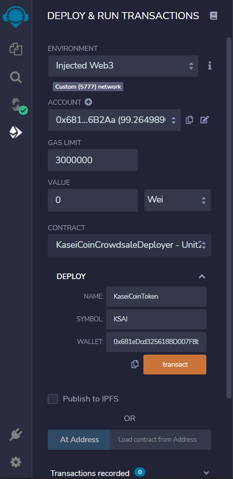
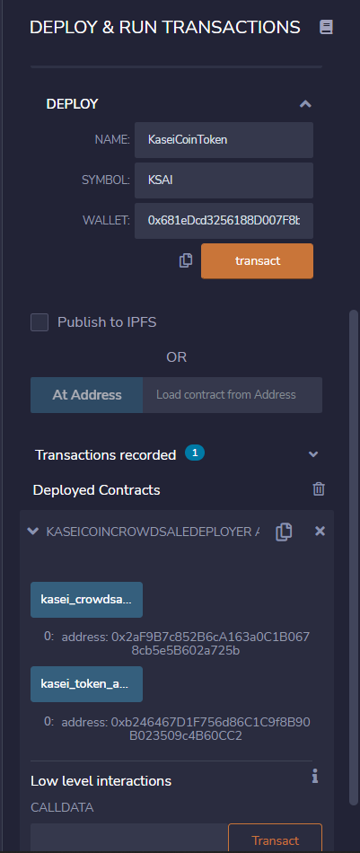
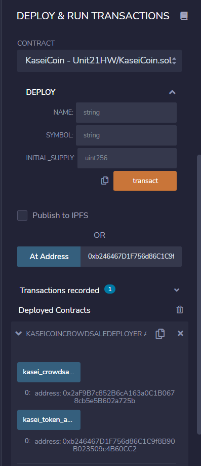
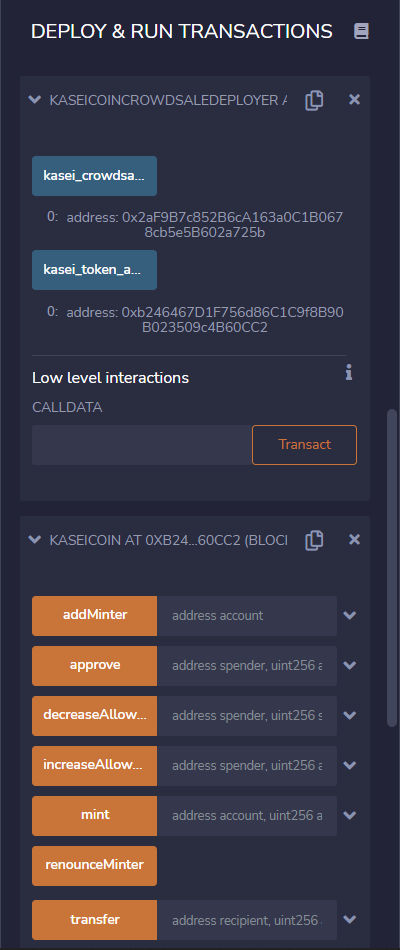
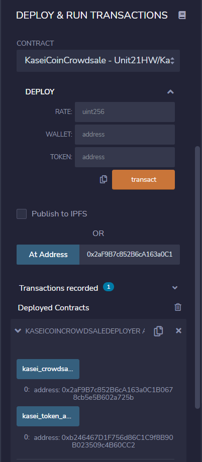
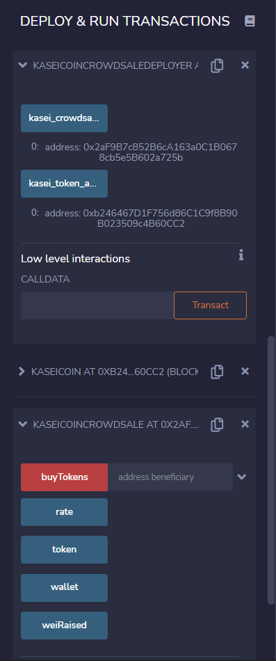
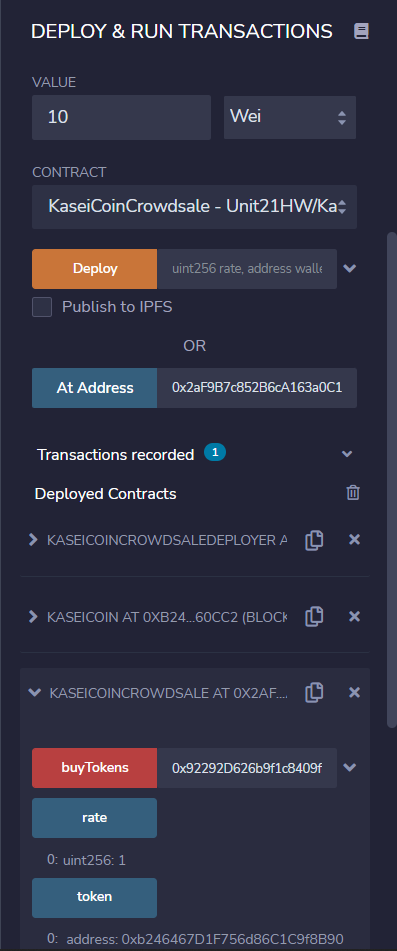
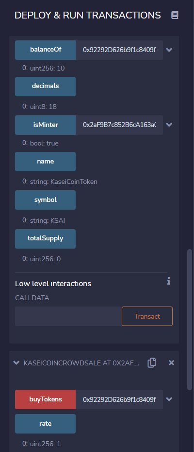
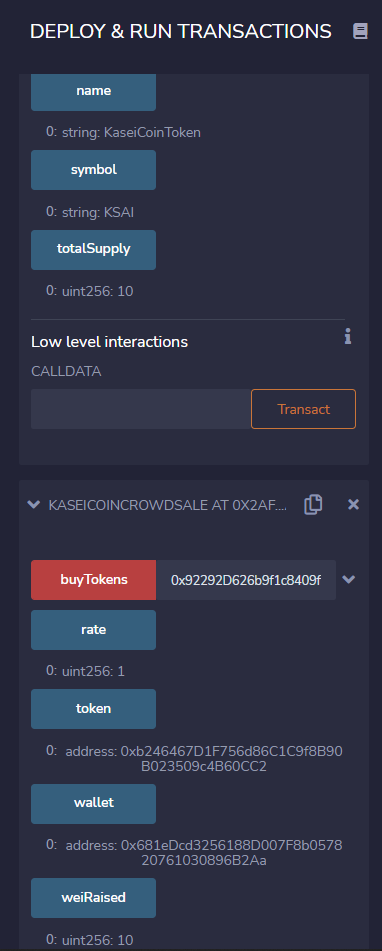

# Martian Token Crowdsale
This prototype project involves three Solidity smart contracts that would allow people moving to Mars to convert their earthling money to a proposed new cryptocurrency named KaseiCoin. The KaseiCoin would be an ERC-20 compliant fungible token, and the currency conversion would be accomplished through a crowdsale.  

## Technologies
The technologies required to use this project are: Remix IDE, MetaMask, and Ganache.

## Examples
Upon deploying the KaseiCoinCrowdsaleDeployer contract, the other two contracts are also created and can be loaded using their contract addresses. Details of how to deploy and load the smart contracts are shown in the "Deployment" section below. Once the KaseiCoin and KaseiCoinCrowdsale smart contracts are loaded, users can buy new tokens for recipient addresses and check the balances of the accounts. They can also view the total supply of minted tokens, and how much wei the crowdsale contract has raised.   

**Deployment:**

In the "Deploy and Run Transactions" pane, the Injected Web3 environment rather than the JavaScript VM must be selected. Next, from the "Contract" dropdown list, the KaseiCoinCrowdsaleDeployer contract should be selected as the contract to deploy. There are three fields: Name, Symbol, and Wallet that need to be filled in before clicking the transact button to deploy the contract.

Once the contract is deployed, it can be opened and the kasei_crowdsale_address and kasei_token_address can be obtained.

Next, the KaseiCoin contract should be loaded by selecting the KaseiCoin contract from the "Contract" dropdown list. Then, copying and pasting the kasei_token_address into the "Load contract from Address" field, and clicking the "At Address" button.

This screenshot shows part of the loaded KasieCoin contract.

The KaseiCoinCrowdsale contract should be loaded similarly, by selecting the KaseiCoinCrowdsale contract from the "Contract" dropdown list, and using the kasei_crowdsale_address as shown below.

This screenshot shows the loaded KaseiCoinCrowdsale contract.

**Buying New Tokens:**

The KaseiCoinCrowdsale contract is used for buying new tokens. First, the user needs to enter an ether denomination amount in the "Value" field (of the Deploy and Run module), then they must enter the recipient address beside the "buyTokens" button prior to clicking the buyTokens button.

Once the tokens have been purchased, the KaseiCoin contract can be used to check the balance of the account. The account address can be entered beside the "balanceOf" button, and when the button is clicked the balance is shown, as in the test example below.

**Checking Total Supply and Amount Raised:**

In addition to checking the balance of an account, users can also view the total supply of minted tokens. To do so, the KaseiCoin smart contract must be accessed. There the "totalSupply" button can be found at the very bottom, which upon clicking will show the updated total.

The amount of wei that the crowdsale contract raised can be viewed using the KaseiCoinCrowdsale contract. The "weiRaised" button is found at the bottom. Following is a screenshot that shows the bottom of the KaseiCoin contract and the KaseiCoinCrowdsale contract. Since zero was the initial totalSupply upon deploying the contracts, the totalSupply and weiRaised will be the same after each buyTokens transaction. 

